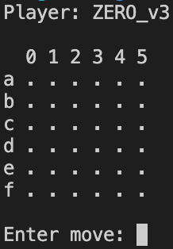

## AlphaZero vs. MCTS: a study on AI-based game strategy in Gomoku

This repository contains the source code for my Bachelor's thesis "AlphaZero vs. MCTS: a study on AI-based game strategy in Gomoku", which I submitted to the Technische Universität Berlin in 2024. 

If you are interested in the theoretical background, the implementation details, or the results of my thesis (in German), you can download the PDF file from [here](https://doc.neuro.tu-berlin.de/bachelor/2024-BA-YamacAy.pdf).

If you use this code or the results of my thesis in your research, please cite my work using the following BibTeX entry:

```tex
@misc{ay2024gomoku,
  title={AlphaZero gegen MCTS: Eine Studie zur KI-basierten Spielstrategie in Gomoku},
  author={Ay, Yamac Eren},
  year={2024},
  howpublished={\url{https://doc.neuro.tu-berlin.de/bachelor/2024-BA-YamacAy.pdf}},
  note={Bachelor's Thesis, Technische Universität Berlin}
}
```

### What is Gomoku?

Gomoku is the same as Tic-Tac-Toe, but on an arbitrary board. The same rules apply: the players take turns to place their stones / marks on the intersections of the board. The first player to form an unbroken row of four / five stones horizontally, vertically, or diagonally wins the game. For more information, refer to the [Wikipedia article](https://en.wikipedia.org/wiki/Gomoku).

### Setup Instructions

> *Note*: I use MacOS and prefer running scripts using Bash shell. If you are using a different operating system or shell, you may need to adjust the following commands accordingly.

Make sure you have installed Python3 on your machine. If not, you can download it from [here](https://www.python.org/downloads/).

Clone this repository to your local machine by running the following command in the terminal:

```bash
git clone https://github.com/yamaceay/gomoku.git
cd gomoku
```

Make sure that your system allows running the scripts in this directory. If not, you can change the permissions by running the following command:

```bash
chmod +x *.sh
```

After that, you are all set. You can start playing against AlphaZero by running the following command:

```bash
./try.sh -g S -p ZERO
```



It renders the game on the terminal, and you can play against the AI by entering the row and column of your move (e.g. `"a0"` or `"b1"`). The AI will respond with its move, and the game continues until one of the players wins or the board is full. Good luck!

Usage: 

```bash
./try.sh [-h] -g {S,M,L} -p {UCT,FLAT,ZERO,ZEROX} [--epsilon EPSILON] [--level LEVEL] [-s]
```